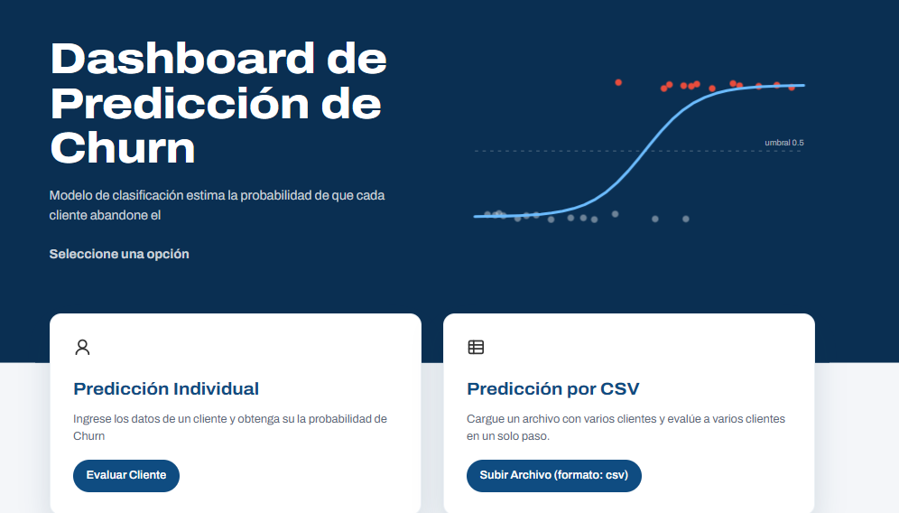
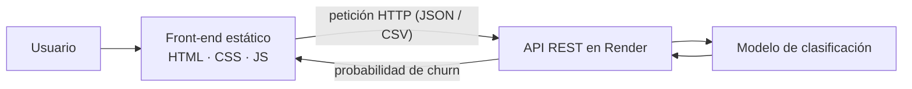

# Dashboard de Predicción de Churn · Front-end

Interfaz web para estimar la probabilidad de que un cliente abandone el servicio (*churn*).
Consume un modelo de Machine Learning expuesto como API REST en Render y permite evaluar
**un cliente** a la vez o **muchos clientes desde un archivo CSV**.




> Este repositorio contiene **solo el front-end**. El modelo y la API están en
> [repositorio del back-end](https://github.com/jpz555/churn-fastapi). <!-- TODO: enlace real -->

**Demo:** [enlace al sitio publicado](https://github.com/jpz555/churn-fastapi) <!-- TODO: enlace real -->

---

## Contenido

- [Funcionalidades](#funcionalidades)
- [Arquitectura](#arquitectura)
- [Tecnologías](#tecnologías)
- [Estructura del proyecto](#estructura-del-proyecto)
- [Ejecución local](#ejecución-local)
- [Configuración](#configuración)
- [Despliegue](#despliegue)
- [Decisiones de diseño](#decisiones-de-diseño)
- [Historial de mejoras](#historial-de-mejoras)
- [Próximos pasos](#próximos-pasos)
- [Autor](#autor)

## Funcionalidades

| Página | Archivo | Qué hace |
|--------|---------|----------|
| Inicio | `index.html` | Presenta el proyecto y permite elegir el tipo de predicción. |
| Predicción individual | `predict.html` | Formulario con los datos de un cliente; muestra su probabilidad de churn. |
| Predicción por CSV | `predict_csv.html` | Carga un archivo con varios clientes y devuelve el riesgo de cada uno. |

## Arquitectura

El front-end es un sitio estático: no tiene servidor propio ni paso de compilación. El navegador
envía los datos del cliente a la API, la API ejecuta el modelo y devuelve la predicción.



La lógica de comunicación está separada en dos archivos:

- **`js/config.js`**: configuración del entorno (URL base de la API).
- **`js/api.js`**: funciones que hacen las peticiones a la API y que reutilizan todas las páginas.

Así, cambiar de entorno (local ↔ producción) solo requiere editar `config.js`.

## Tecnologías

- **HTML5** semántico.
- **CSS3** con variables (*custom properties*), Grid, Flexbox y diseño responsivo. Clases con convención BEM.
- **JavaScript** (vanilla), sin frameworks ni dependencias.
- **Google Fonts**: tipografía Archivo.
- **Render**: hosting de la API del modelo.

## Estructura del proyecto

```text
.
├── index.html              # Página de inicio
├── predict.html            # Predicción individual
├── predict_csv.html        # Predicción por CSV
├── styles/
│   ├── main.css            # Estilos globales: variables, layout, tarjetas y botones
│   └── home.css            # Estilos exclusivos de la página de inicio
│   └── predict.css         # Estilos exclusivos de pagina de predicción (solo cliente)
│   └── predict_csv.css     # Estilos exclusivos de pagina de predicción (archivo varios clientes)
├── js/
│   ├── config.js           # URL de la API
│   └── api.js              # Peticiones a la API
│   └── utils.js            # Utilidades de interfaz del usuario lógica de negico
│   └── predict.js          # Logica prediccion cliente
│   └── predict_csv.js      # Logica prediccion clientes
└── docs/
    ├── img/                # Capturas para la documentación
    └── release-notes/      # Registro de mejoras del proyecto
```

<!-- TODO: agregar aquí otros archivos que existan (p. ej. styles/predict.css, js/predict.js) -->

## Ejecución local

Al ser un sitio estático, basta con servir la carpeta. Se recomienda usar un servidor local en
lugar de abrir el archivo con doble clic: con `file://` el navegador puede bloquear las
peticiones a la API.

**Opción 1: Python**

```bash
git clone https://github.com/jpz555/Churn-Web-v1.git
cd REPO
python -m http.server 5500
```

Luego abre <http://localhost:5500>.

**Opción 2: VS Code**

Instala la extensión *Live Server*, haz clic derecho sobre `index.html` y elige **Open with Live Server**.

## Configuración

La URL de la API se define en `js/config.js`:

```js
// js/config.js  (TODO: ajustar al contenido real del archivo)
const API_URL = "https://github.com/jpz555/churn-fastapi";
```

| Entorno | Valor sugerido |
|---------|----------------|
| Producción | URL del servicio en Render |
| Local (API corriendo en tu máquina) | `http://localhost:8000` <!-- TODO: puerto real --> |

> **Importante:** la API debe permitir peticiones desde el dominio donde se publica el front-end
> (configuración **CORS** en el back-end). De lo contrario, el navegador bloqueará las peticiones.

### Sobre el plan gratuito de Render

En el plan gratuito, Render suspende el servicio tras un periodo sin uso. La primera petición
después de eso puede tardar alrededor de un minuto mientras el servidor arranca; las siguientes
son rápidas.

## Despliegue

Cualquier hosting de sitios estáticos sirve. Dos opciones gratuitas:

**GitHub Pages**

1. En el repositorio: **Settings → Pages**.
2. En *Source*, elige la rama `main` y la carpeta `/ (root)`.
3. El sitio queda en `https://github.com/jpz555/Churn-Web-v1`.

Las rutas del proyecto son relativas (`styles/…`, `js/…`), así que funcionan aunque el sitio
se publique en una subcarpeta.

**Render (Static Site)**

1. *New → Static Site* y conecta el repositorio.
2. *Build command*: vacío. *Publish directory*: `.`

## Decisiones de diseño

- **Sin frameworks.** Para tres páginas que consumen una API, HTML, CSS y JS nativos son suficientes,
  cargan rápido y no requieren compilación.
- **Configuración separada de la lógica** (`config.js` / `api.js`): un solo punto para cambiar de entorno.
- **CSS en capas:** `main.css` con estilos compartidos y una hoja por página para lo específico.
- **Identidad visual del dominio:** el encabezado de la home muestra una curva de regresión logística con
  el umbral de decisión, que explica visualmente qué hace el modelo.
- **Accesibilidad:** HTML semántico, idioma declarado, foco visible al navegar con teclado y respeto por la
  preferencia de *movimiento reducido* del sistema.

## Historial de mejoras

Cada mejora se documenta en [`docs/mejoras/`](docs/release-notes/) con el problema, los cambios y cómo verificarlos.

| # | Mejora | Fecha |
|---|--------|-------|
| 001 | [Rediseño de la página de inicio](docs/release-notes/v1.2.0.md) | 2026-10-08 |

## Próximos pasos

- [ ] Llevar el diseño del encabezado a `predict.html` y `predict_csv.html`.
- [ ] Indicador de estado de la API en la página de inicio.
- [ ] Unificar modificadores BEM (`btn__primary` → `btn--primary`).
- [ ] Agregar un CSV de ejemplo para probar la predicción por lote.

## Autor
**NOMBRE: Ing. Juan Pablo Palacio Zapata** <!-- TODO -->
[GitHub](https://github.com/jppz) · <!-- [LinkedIn](https://www.linkedin.com/in/USUARIO/)-->

## Licencia
Distribuido bajo la licencia. Todos los derechos reservados por el Autor. <!-- Ver [`LICENSE`] (LICENSE)-->. <!-- TODO: confirmar o quitar -->
<p align="center">Copyright © 2026 - Desarrollado por Juan Palacio</p>